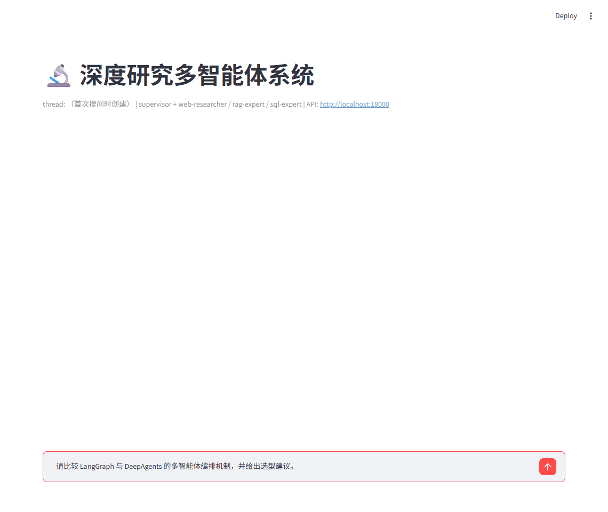

# Deep Research — 多智能体深度研究系统

[](https://github.com/lzy-sys/deep-research-agents/actions/workflows/ci.yml)

[](LICENSE)

基于 **deepagents + LangGraph + LangChain** 构建的多智能体深度研究系统：研究主管（Supervisor）拆解课题并派发专家子智能体（网络调研 / 知识库问答 / 数据库分析），汇总结论生成带来源标注的 Markdown 研究报告，跨会话长期记忆让系统越用越懂你。



详细设计见 [架构说明](docs/ARCHITECTURE.md)，实验方法与原始结果见 [Benchmarks](docs/BENCHMARKS.md)。

## 核心特性

- **三类异构数据源统一编排**：web_researcher（Tavily 网络检索）+ rag_expert（本地双语知识库）+ sql_expert（豆瓣电影库只读 text2sql），Supervisor 按子课题性质自动分流
- **deepagents 声明式多智能体**：主智能体通过内置 `task` 工具并行派发 subagent，各子智能体独立上下文、只回传压缩结论——上下文不爆炸
- **Agentic RAG**：代码控制 `retrieve → grade → rewrite/retry → RRF/词项重排 → fallback`，最多 3 轮；24 条评测中 hit@5 从单次向量检索的 87.5% 提升到 95.8%，检索不到时明确建议转交 web 调研
- **text2sql 安全闸门**：纯代码校验（仅 SELECT/WITH、禁多语句与注释、LIMIT 收敛、SQLite 只读 URI 物理防写），覆盖 DROP/DELETE/UPDATE/PRAGMA/ATTACH 等 9 类恶意语句的拦截矩阵
- **跨会话长期记忆（SQLite 结构化条目）**：用户偏好与研究结论分条存 `data/memory.sqlite`（上限 50 条，满员自动淘汰最旧结论），Supervisor 通过 `save_memory`/`delete_memory` 工具自主读写，下次会话注入提示词；WebUI 支持逐条查看/删除，旧 AGENTS.md 首次启动自动迁移
- **双语知识库**：LangChain/LangGraph/DeepAgents 英文官方文档 + 智谱 GLM 中文文档，qwen3-embedding 多语言向量跨语言检索，回答用中文、代码保留英文
- **分档模型**：research（主管/RAG/SQL 专家）/ summarize（web-researcher 高频调用）两档独立配置（OpenAI 兼容网关一键接入），为按档换模型留好接缝
- **单 Agent 对照实验**：固定检索工具后对比单 Agent 与多 Agent 编排；3 个样本上确定性质量代理 0.80 → 1.00，代价是 p50 延迟 11.1s → 79.5s、token 6,059 → 68,755，明确展示质量/成本取舍
- **持久化任务与可重放 SSE**：任务状态和事件写入 SQLite，支持递增事件 ID、`Last-Event-ID` 断点续读、取消请求、幂等键和服务重启恢复

## 架构

```
CLI (rich 流式) ──► deepagents 主智能体（Supervisor）
                     │ write_todos 规划 → task 工具并行派发
        ┌────────────┼────────────────┐
        ▼            ▼                ▼
  web-researcher  rag-expert      sql-expert
  Tavily快搜/深搜  FAISS检索+自纠错  只读SQL+安全闸门
        └──────── 结论回传（压缩 Note）────────┘
                     │ 验收充分性 → 不足再派发
                     ▼
        write_file → reports/日期_主题.md
                     ▼
        save_memory → memory.sqlite（长期记忆分条存取）
```

## 快速开始

```bash
uv sync                                        # 安装依赖
cp .env.example .env                           # 填入 Key（见下）
uv run python -m src.deep_research.sanity_check  # 连通性自检，应 5/5 PASS
uv run python scripts/ingest.py                # 构建知识库（约 15-40 分钟，本地 embedding）
uv run python scripts/setup_db.py              # 下载豆瓣电影数据建 SQLite 分析库
uv run python -m src.deep_research.main "你的研究主题"   # 单次研究
uv run python -m src.deep_research.main        # 进入多轮会话（/new /memory /reports /quit）
```

`.env` 需要三个外部服务 Key，另可选配置 API 鉴权：

| 变量 | 说明 |
|---|---|
| `OPENCODE_API_KEY` / `OPENCODE_BASE_URL` | OpenCode Go 套餐网关（OpenAI 兼容），两档模型默认 deepseek-v4-flash，可在套餐内换 Kimi/GLM 等 |
| `TAVILY_API_KEY` | tavily.com 免费额度 1000 次/月 |
| `OLLAMA_BASE_URL` / `EMBEDDING_MODEL` | 本地 Ollama，默认 qwen3-embedding:0.6b（1024 维），embedding 零 API 成本 |
| `API_KEY` | 可选；设置后所有 `/api` 请求必须带 `X-API-Key` 或 Bearer，WebUI 自动透传 |

## 模块结构

```
src/deep_research/
├── configuration.py    # 全局配置（.env 直读）
├── llm.py              # 分档模型工厂
├── prompts.py          # 全部提示词集中管理
├── graph.py            # 图编译入口 + 共享 SqliteSaver（API/CLI 会话持久化）
├── main.py             # 多轮 CLI
├── sanity_check.py     # 五项连通性自检
├── agents/             # supervisor + 3 个声明式 subagent
├── api/                # FastAPI + SQLite run/event store（SSE 重放与取消）
├── tools/              # search(Tavily) / retrieval(FAISS) / sql_tools(只读闸门)
└── memory/             # SQLite 长期记忆：store(存储/迁移/容量) + tools(supervisor 读写工具)
scripts/
├── ingest.py           # 语料抓取(llms.txt)→清洗→切块→FAISS 入库
└── setup_db.py         # 豆瓣电影数据下载建库校验
reports/                # 生成的研究报告
data/                   # 知识库语料 / FAISS 索引 / 豆瓣电影库
docs/                   # 架构、benchmark 与示例报告
```

## 关键设计决策（踩坑实录）

1. **chromadb 1.5.9 → FAISS**：chromadb rust 版 HNSW 段在 Windows 上跨进程加载必崩（建库进程内可查、新进程 `Error loading hnsw index`），连换三处写法复现同一根因，弃用。改用 FAISS 引擎 + `faiss.serialize_index` 序列化。
2. **faiss C++ 文件 IO 的中文路径 bug**：`faiss.write_index` 底层 `fopen` 收到 UTF-8 字节、Windows 按 GBK 解析，含中文的项目路径直接"路径不存在"。修复：索引文件读写全部走 Python 侧（serialize_index 字节 + pickle 元数据）。
3. **changelog 页是检索黑洞**：发布日志堆满功能关键词，把真正的文档挤出 top-k。入库时按 URL 排除，并过滤站点导航 JSON 块（`"href"`+`"title"` 签名 + 标点密度），语料从 14,453 块瘦身到 7,568 块，检索命中全正。
4. **长期记忆 v1 文件方案 → v2 SQLite 条目**：v1 直接用 AGENTS.md（deepagents 文件工具读写），零自研但无法逐条管理、容量不可控、前端直读文件有并发冲突。v2 改为结构化条目库（data/memory.sqlite）：Supervisor 挂 `save_memory`/`delete_memory` 自定义工具读写，条目带 id 注入提示词便于精确清理，容量 50 条自动淘汰最旧结论；旧文件首次建库自动迁移（meta 表打标防重复导入）。
5. **报告日期注入**：LLM 会臆造日期，当前日期必须由系统注入提示词。

## 部署（Docker）

```bash
docker compose up -d      # api :18000 + webui :8501（默认仅本机访问；.env 自动注入，data/reports 卷挂载，记忆库随 data 持久化）
```

- embedding 走宿主机 Ollama（容器内自动配置 `host.docker.internal`），LLM 走网关，密钥不进镜像
- Windows 中文项目路径下 buildx 会报 non-ASCII 错误，用 `DOCKER_BUILDKIT=0 docker compose build`（compose up 同理）
- 端口说明：api 宿主机侧映射为 **127.0.0.1:18000**（8000 常被其他服务占用），容器内仍是 8000；两个端口默认只绑定本机，避免未认证接口暴露到局域网
- 部署到共享环境时设置 `API_KEY`，并保留本机端口绑定或在前置网关再加 TLS、限流和访问审计

## 测试与评测

```bash
uv run ruff check .                         # 静态检查
uv run pytest --cov=deep_research -q        # 单元测试 + 覆盖率（60 项，无网络即可运行）
uv run python evals/eval_retrieval.py       # 检索评测（24 条 QA，输出量化报告）
uv run python evals/compare_retrieval.py    # 单次向量检索 vs Agentic RAG 对照
uv run python evals/compare_agents.py       # 单 Agent vs 多 Agent 编排对照
```

- **单元测试**：SQL 安全闸门拦截矩阵（9 类恶意语句 + 注释混淆）、LIMIT 自动补全/收敛、只读 URI 物理防写、语料垃圾块过滤、记忆库增删查/容量淘汰/去重/旧文件迁移、配置派生、FAISS 离线确定性检索；真实索引 + Ollama 作为可选集成测试
- **检索评测集**（`evals/qa_dataset.jsonl`，24 条）：覆盖 langgraph / deepagents / langchain / bigmodel-zh 四板块，指标 **hit@5**、**MRR** 与延迟分位数；逐条明细写入 `reports/eval_retrieval.md`，机器可读结果写入 `evals/results/retrieval_latest.json`
- 结果文件记录 Git SHA、dirty 状态、数据集 SHA-256、embedding 模型/维度、索引规模和 p50/p95 延迟，避免只保留不可追溯的百分比
- 单次向量基线：**hit@5 = 87.5%（21/24），MRR = 0.719，p95 = 0.152s**
- Agentic RAG 对照：**hit@5 = 95.8%（23/24），MRR = 0.741，p50 = 0.133s，p95 = 41.0s**；普通查询保持低延迟，低置信查询用尾部延迟换召回
- CI 执行 Ruff、单元测试和覆盖率门禁；当前 60 项测试、覆盖率为 71.61%

## Roadmap

- [x] FastAPI 服务化（SSE 流式）+ Web UI（节点执行进度可视化）
- [x] 长期记忆升级 SQLite 结构化条目（容量上限 + 逐条管理）
- [ ] RAGAS 量化评估（faithfulness / answer_relevancy / context_precision / context_recall）
- [ ] 成本/Token 统计面板、失败降级链（DeepSeek→GLM→Kimi 调度）
- [x] 单 Agent 基线对比实验（当前为 3 个代表任务的初步对照，后续可扩样）
- [x] 代码控制 Agentic RAG（grade / rewrite / RRF+词项重排 / fallback）
- [ ] Self-RAG/CRAG 显式节点图 + RAGAS 答案级评估
- [ ] MCP 工具源接入、Prompt injection 防御演示
