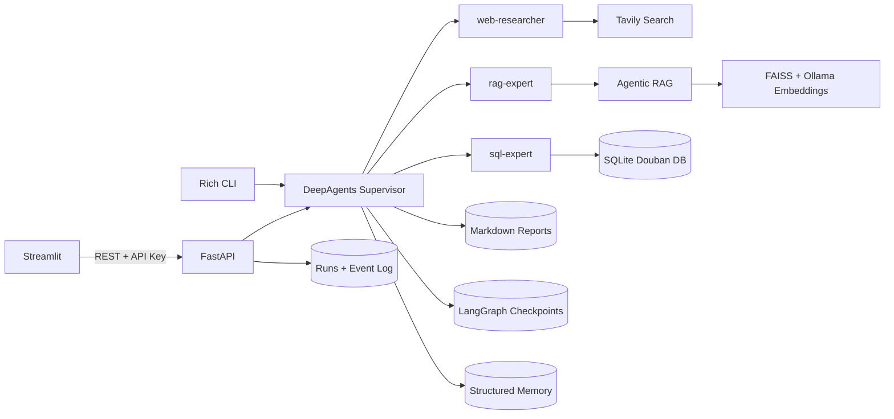

# Architecture

## Runtime

## Durable Runs

- `POST /api/research` creates a persisted run and starts an in-process worker.
- Every tool/final/error event is stored in `runs.sqlite` with a monotonically increasing ID.
- SSE readers can reconnect with `Last-Event-ID` and receive only missing events.
- `Idempotency-Key` prevents duplicate task creation.
- On restart, unfinished runs are marked failed and an error event is appended instead of remaining stuck forever.
- `POST /api/research/{thread_id}/cancel` requests cooperative cancellation between graph chunks.

## Trust Boundaries

- The supervisor filesystem backend is rooted at `reports/` and only exposes `read_file` and `write_file`.
- SQL uses a SELECT/WITH gate, blocks comments and multiple statements, caps `LIMIT`, and connects through SQLite `mode=ro`.
- Tavily and database results are wrapped as `<untrusted_*_content>`; prompts explicitly forbid following instructions found inside them.
- When `API_KEY` is configured, all `/api` routes require `X-API-Key` or Bearer authentication.
